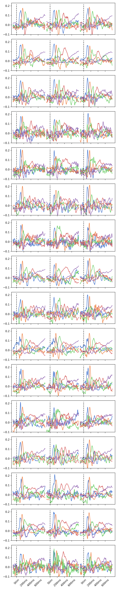
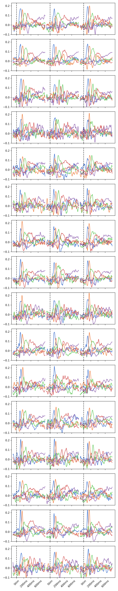

# Coupled Generator Decomposition for Fusion of Electro- and Magnetoencephalography Data

This repository contains the implementation of the Coupled Generator Decomposition (CGD) model, which could used for multisubject, multimodal, or multigroup modeling. The model introduced here extends sparse principal component analysis (SPCA) for data fusion, enabling the identification of common features across diverse data sources while accommodating modality- and subject-specific variability. The model also includes archetypal analysis and [directional archetypal analysis](https://www.frontiersin.org/journals/neuroscience/articles/10.3389/fnins.2022.911034/full). Please cite the Following paper if you use this repository in your own work:

_Coupled generator decomposition for fusion of electro- and magnetoencephalography data_, AS Olsen, JD Nielsen, M Mørup (in prep, 2024)

## Introduction

The main Python class `CGD.py` implements the Coupled Generator Decomposition model for a variable number of input data dimensions. The input data `X` should always be a dictionary of torch tensors. If you have data of varying dimensions, such as EEG/MEG or two clinical groups of differing number of subjects, then the data for these should be in each their tensor, and the tensors should be input as a dictionary, e.g., `X = {'EEG':EEGdata,'MEG':MEGdata}`.

### Requirements
- PyTorch

### Input Data Format

- **Required inputs:**
    - `num_comp`: the number of components to learn
    - `X`: a dictionary of torch tensors, each element of size (*,N,P), where * may be any number of extra dimensions.
- **Optional inputs:**
    - `model`: the model to use. Options are 'SPCA', 'AA', 'DAA'. Default is 'SPCA'.
    - `Xtilde`: a dictionary of torch tensors. If not specified, `Xtilde` is assumed to be equal to `X`.
    - `G_idx`: a boolean tensor of size `(P,)` indicating which dimensions to construct `Xtilde` from (default all ones).
    - `lambda1`: the L1 regularization parameter for SPCA.
    - `lambda2`: the L2 regularization parameter for SPCA.
    - `init`: a dictionary of torch tensors, specifying the initial values for G (and S, if model=='AA').

### Supported Models

- **SpPCA**: Sparse Principal Component Analysis, in which L1 and L2 regularization coefficients must be provided. For sparse PCA, the model optimizes a shared generator matrix G `(P,K)` and a mixing matrix S `(*,K,P)` is inferred using a procrustes transformation through `(X.T@Xtilde)@G`.
- **AA**: Archetypal Analysis, in which the model optimizes a shared generator matrix G `(P,K)` and a mixing matrix S `(*,K,P)`. Both G and S are assumed non-negative and sum-to-one constraints enforced through the softmax function. 
- **DAA**: Directional Archetypal Analysis, which works similarly to AA except the data are assumed to be on a sign-invariant hypersphere.

## Author

- **Anders S Olsen**
- **Affiliation:** DTU Compute
- **Year:** 2023-2024
- **Latest Update:** February 2024

## Distribution of S matrix over subjects (EEG left, MEG right)

    
    

